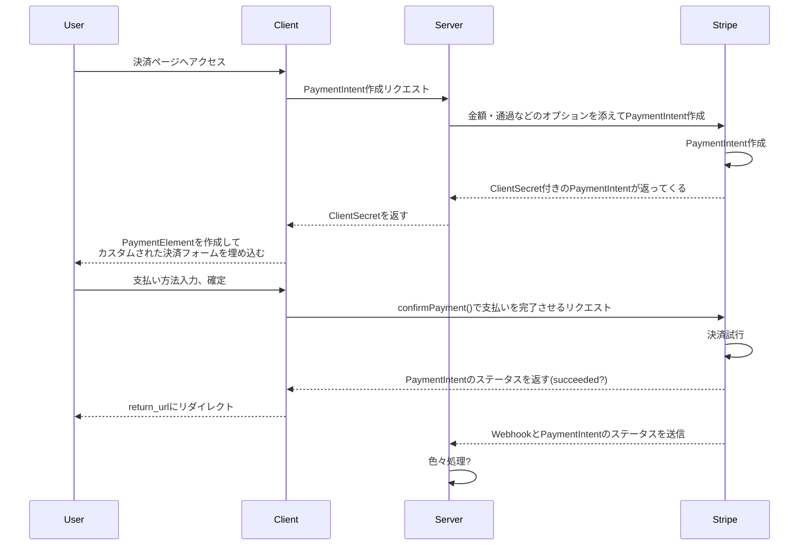

```mermaid
sequenceDiagram
    participant U as User
    participant C as Client
    participant S as Server
    participant St as Stripe
    
    U->>C: 決済ページへアクセス
    C->>S: PaymentIntent作成リクエスト
    S->>St: 金額・通過などのオプションを添えてPaymentIntent作成
    St->>St: PaymentIntent作成
    St-->>S: ClientSecret付きのPaymentIntentが返ってくる
    S-->>C: ClientSecretを返す
    C-->>U: PaymentElementを作成して<br>カスタムされた決済フォームを埋め込む
    U->>C: 支払い方法入力、確定
    C->>St: confirmPayment()で支払いを完了させるリクエスト
    St->>St: 決済試行
    St-->>C: PaymentIntentのステータスを返す(succeeded?)
    C-->>U: return_urlにリダイレクト
    St-->>S: WebhookとPaymentIntentのステータスを送信
    S->>S: 色々処理?
```